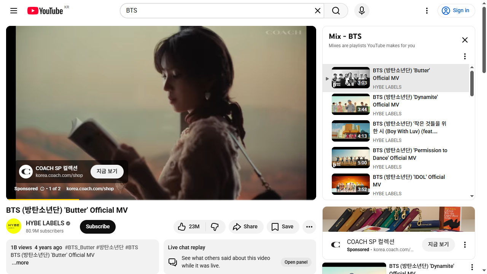
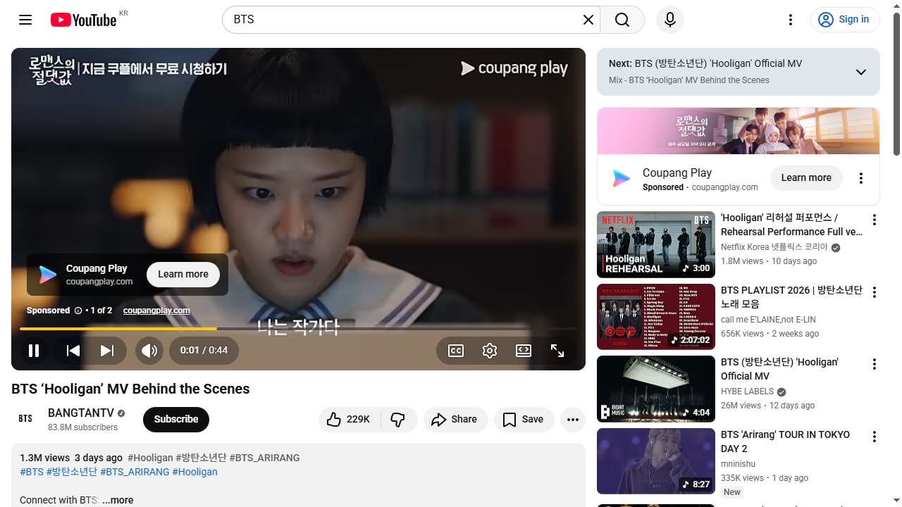

# TC-001 테스트 결과

- **날짜**: 2026-04-20
- **시각**: (이전 세션 기록)
- **실행 방법**: Playwright (headless Chromium)
- **상태**: ✅ PASSED

## 단계별 결과
| 단계 | 액션 | 결과 | 비고 |
|------|------|------|------|
| 1 | YouTube 홈페이지 접속 | ✅ | networkidle 대기 |
| 2 | 검색창 클릭 | ✅ | input[placeholder="Search"] |
| 3 | "BTS" 입력 | ✅ | |
| 4 | Enter 검색 | ✅ | 검색 결과 로드 |
| 5 | 검색 결과 확인 | ✅ | 196개 비디오 발견 |
| 6 | 첫 번째 비디오 클릭 | ✅ | BTS (방탄소년단) 'Butter' Official MV |
| 7 | 재생 확인 | ✅ | 페이지 타이틀 BTS 포함 |

## TC-001b (Direct URL)
| 단계 | 결과 | 비고 |
|------|------|------|
| URL 직접 이동 | ✅ | |
| 첫 번째 비디오 클릭 | ✅ | BTS 'Hooligan' MV Behind the Scenes |
| 재생 확인 | ✅ | |

## 소요시간
- TC-001: 13.3초
- TC-001b: 8.3초
- 합계: 21.6초

## 스크린샷
- 
- 
