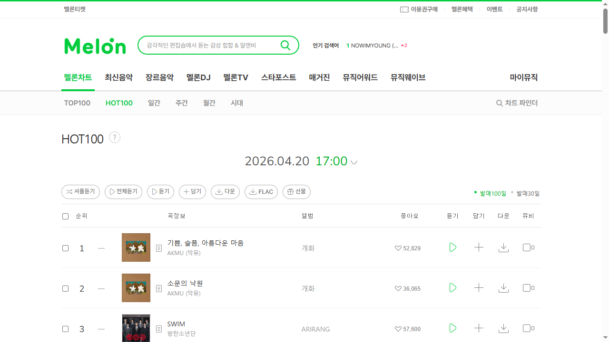
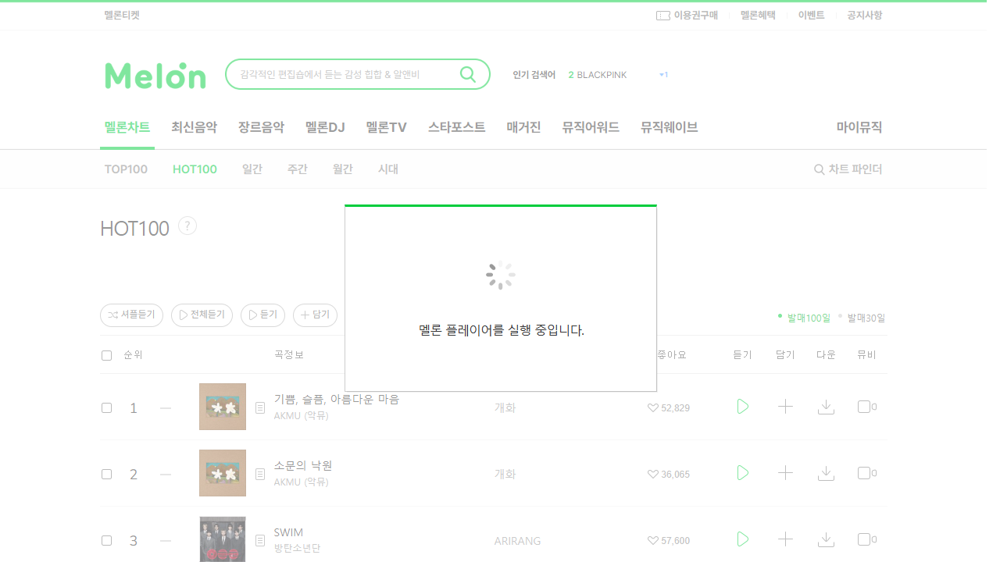

# TC-002 테스트 결과

- **날짜**: 2026-04-20
- **시각**: 14:00 KST
- **상태**: ⚠️ BLOCKED

## browser-harness 실행 결과

| 단계 | 액션 | 결과 | 비고 |
|------|------|------|------|
| 1 | 멜론 홈페이지 접속 | ✅ | |
| 2 | 멜론차트 이동 | ✅ | 이미 기본 선택 메뉴 |
| 3 | HOT100 클릭 | ✅ | x=469, y=217 |
| 4 | 2순위 듣기 버튼 클릭 | ⚠️ | 플레이어 앱 요구 팝업 |

## Playwright 실행 결과 (9.1s)

| 단계 | 액션 | 결과 | 비고 |
|------|------|------|------|
| 1 | HOT100 직접 접속 | ✅ | |
| 2 | HOT100 로드 확인 | ✅ | |
| 3 | 2순위 곡 정보 확인 | ✅ | 소문의 낙원 - AKMU (악뮤) |
| 4 | 듣기 버튼 클릭 | ✅ | |
| 5 | 팝업 감지 | ⚠️ SKIPPED | melonplayer:// 미지원 (Chromium) |

## 이슈

- browser-harness(실제 Chrome): "설치가 필요합니다" 팝업
- Playwright(Chromium): "실행 중입니다" 로딩 팝업에서 멈춤 — melonplayer:// 프로토콜 미등록
- 두 환경 모두 BLOCKED. 멜론 플레이어 앱 설치 필요

## 2순위 곡 (2026-04-20 14:00 기준)
- **곡명**: 소문의 낙원 / **아티스트**: AKMU (악뮤) / **앨범**: 개화

## 스크린샷
- 
- 
- 

## 오류 기록
- [x] `browser-harness/domain-skills/melon/scraping.md` ERR-001, ERR-002 업데이트 완료
