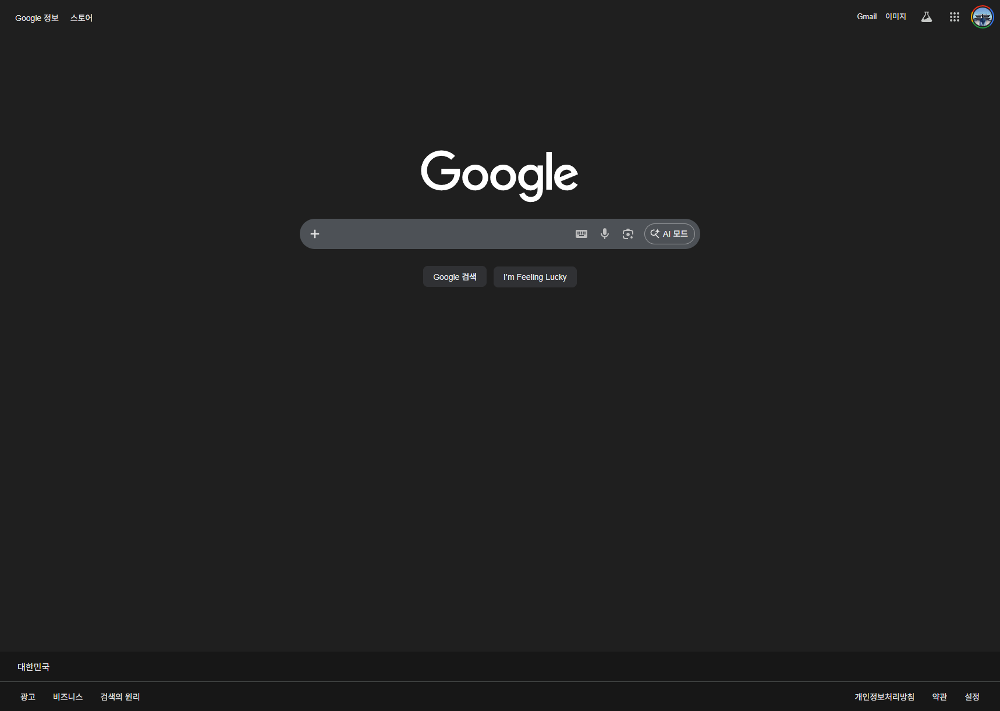
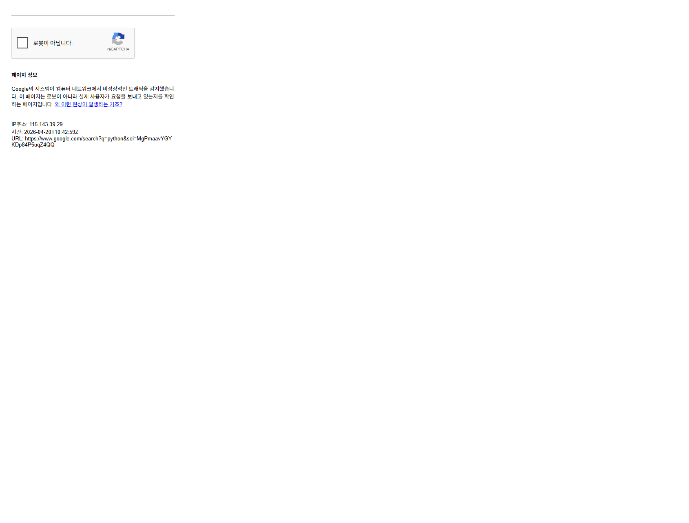

# TC-003 테스트 결과

- **날짜**: 2026-04-20
- **상태**: ⚠️ BLOCKED

## browser-harness 실행 결과

| 단계 | 액션 | 결과 | 비고 |
|------|------|------|------|
| 1 | Google 홈페이지 접속 | ✅ | https://www.google.com |
| 2 | python 검색 | ⚠️ | reCAPTCHA 차단 — /sorry/index 리다이렉트 |
| 3 | 첫번째 링크 클릭 | ⬜ 미실행 | CAPTCHA 미해결 |
| 4 | Downloads 클릭 | ⬜ 미실행 | CAPTCHA 미해결 |

## Playwright 실행 결과

| 단계 | 액션 | 결과 | 비고 |
|------|------|------|------|
| 1 | Google 홈페이지 접속 | ✅ | |
| 2 | python 검색 입력 | ✅ | 입력 자체는 성공 |
| 2.5 | CAPTCHA 감지 | ⚠️ SKIPPED | ERR-001 — reCAPTCHA 차단 |
| 3 | 첫번째 링크 클릭 | ⬜ 미실행 | |
| 4 | Downloads 클릭 | ⬜ 미실행 | |

## 이슈

- Google TestData 전용 프로필에 세션 쿠키 없어 검색 요청 시 reCAPTCHA 차단
- browser-harness와 Playwright 모두 동일하게 CAPTCHA에 막힘
- **Chrome 자동 실행은 정상 동작**: TestData 프로필로 2초 내 시작 완료 (port 65481)

## 해결 방법

1. TestData 프로필에서 수동으로 Google 검색 1회 수행 (쿠키 확립)
2. 또는 `output/TS/auth.json`에 storageState 저장 후 Playwright에서 재사용
3. 이후 재실행 시 CAPTCHA 없이 통과 예상

## 스크린샷
- 
- 

## 오류 기록
- [x] `browser-harness/domain-skills/google/scraping.md` ERR-001 업데이트 완료
