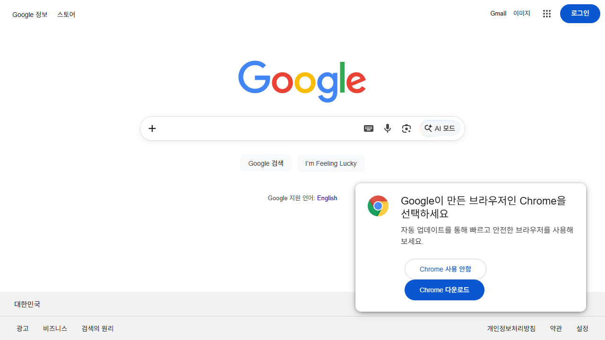
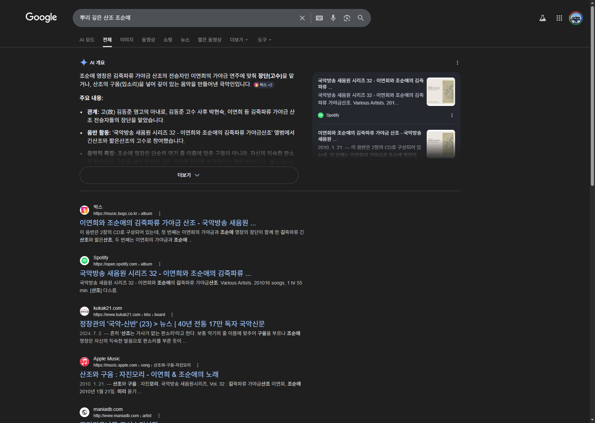
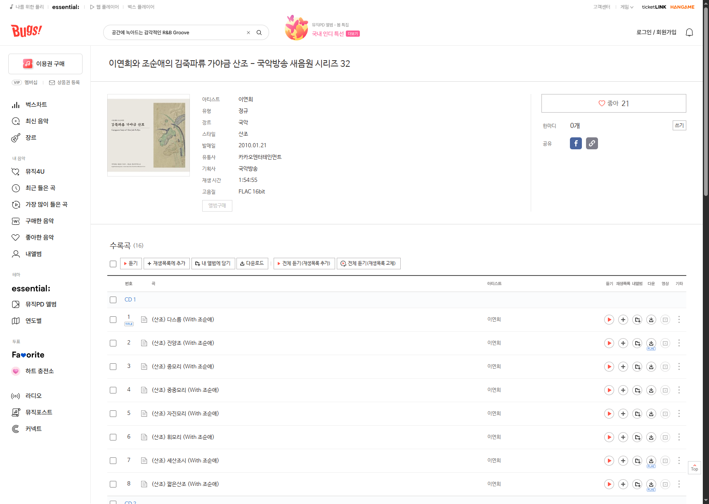

# TC-004 테스트 결과

- **날짜**: 2026-04-20
- **상태**: ⚠️ BLOCKED (Playwright CAPTCHA)

## browser-harness 실행 결과 ✅ 전체 성공

| 단계 | 액션 | 결과 | 비고 |
|------|------|------|------|
| 1 | Google 홈페이지 접속 | ✅ | |
| 2 | "뿌리 깊은 산조 조순애" 검색 | ✅ | CAPTCHA 없음 (사용자 Chrome 쿠키) |
| 3 | 조순애 앨범 링크 확인 | ✅ | Bugs Music: 이연희와 조순애의 김죽파류 가야금 산조 |
| 4 | 앨범 페이지 진입 | ✅ | https://music.bugs.co.kr/album/215311 |

## Playwright 실행 결과

| 단계 | 결과 | 비고 |
|------|------|------|
| 1 | ✅ | Google 홈 접속 |
| 2 | ✅ | 검색어 입력 |
| 2.5 | ⚠️ SKIPPED | CAPTCHA 감지 — Playwright Chromium 쿠키 없음 |

## 이슈

- browser-harness(사용자 Chrome): 쿠키 있어 CAPTCHA 없이 전 단계 성공
- Playwright(Chromium 신규 컨텍스트): Google 세션 쿠키 없음 → CAPTCHA 차단
- CAPTCHA는 서비스 환경 제약이므로 BLOCKED 처리

## 발견 정보

- 검색어: "뿌리 깊은 산조 조순애"
- 결과: "이연희와 조순애의 김죽파류 가야금 산조 - 국악방송 새음원 시리즈 32"
- 앨범 URL: https://music.bugs.co.kr/album/215311
- 참고: 검색결과 클릭 시 Google 리디렉트로 이동 안 됨 → `goto(href)` 직접 이동 필요

## 해결 방법 (PASSED 전환 방법)

Playwright `storageState`로 사용자 Chrome 쿠키 저장 후 재사용:

```bash
# 1. 사용자 Chrome에서 쿠키 저장
browser-harness <<'PY'
import json
cookies = cdp("Network.getAllCookies")["cookies"]
open("output/TS/google-cookies.json", "w").write(json.dumps({"cookies": cookies}))
PY

# 2. playwright.config.ts에 storageState 추가
# storageState: '../google-cookies.json'
```

## 스크린샷
- 
- 
- 
